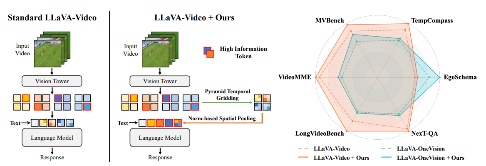
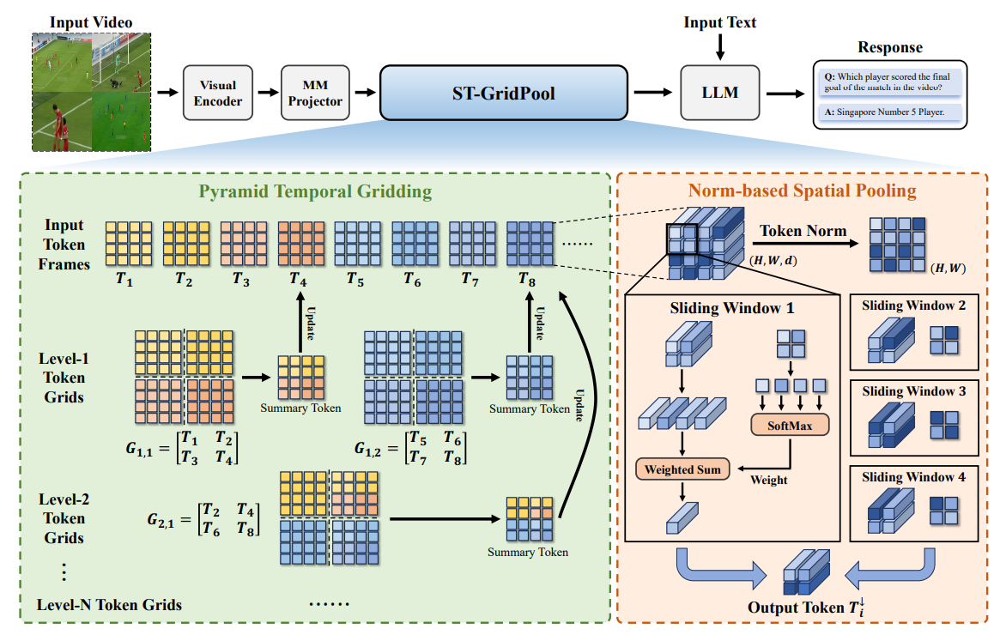
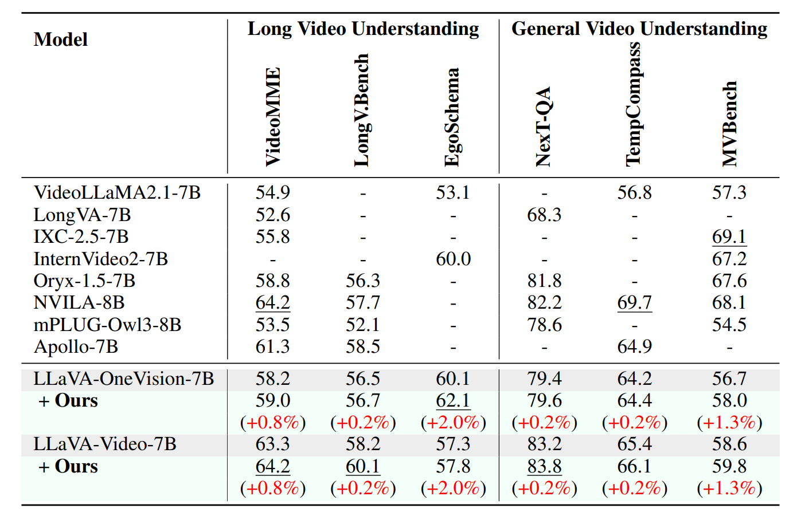
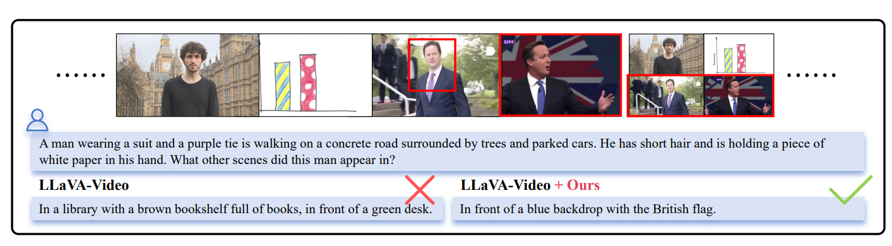

# Enhancing Visual Token Representations for Video Large Language Models via Training-Free Spatial-Temporal Pooling and Gridding

<div align="center">

**ICLR 2026 (Poster)**

[](https://openreview.net/forum?id=MZi9SYPVz5)
[](LICENSE)

</div>

---



## Overview

**ST-GridPool** is a training-free visual token enhancement method tailored for Video LLMs. It optimizes spatiotemporal token compression through two complementary components:

- **Pyramid Temporal Gridding (PTG)** — captures multi-grained temporal dynamics via hierarchical gridding over the temporal dimension.
- **Norm-based Spatial Pooling (NSP)** — preserves high-information spatial regions by leveraging the positive correlation between token norms and semantic richness.



ST-GridPool significantly enhances video understanding performance across multiple benchmarks and models (e.g., LLaVA-Video, LLaVA-OneVision) without requiring any retraining, serving as a plug-and-play enhancement for existing Video LLMs.

## Results

We evaluate ST-GridPool on a diverse set of long-form and general video understanding benchmarks.



Qualitative examples from LongVideoBench:



## Environment Setup

> The evaluation framework is built on [lmms-eval](https://github.com/EvolvingLMMs-Lab/lmms-eval).

```bash
# 1. Create and activate a new conda environment
conda create --name exp python=3.10 -y
conda activate exp

# 2. Install PyTorch (use pip to avoid conda symbol conflicts)
pip install torch==2.2.0 torchvision==0.17.0 torchaudio==2.2.0 --index-url https://download.pytorch.org/whl/cu121

# 3. Install FlashAttention
pip install flash-attn==2.5.0 --no-build-isolation

# 4. Install the package and its dependencies
pip install -e .

# 5. Install additional dependency
pip install open-clip-torch==2.29.0
```

> **Note:** If you encounter `protobuf` installation errors, ensure the dependency reads `protobuf>=3.20` in `pyproject.toml` (not `protobuf==3.20`).

## Evaluation

We provide example scripts for reproducing the results of our method. Raw logs of experimental results are stored in the `logs/` directory.

### Video-MME

```bash
TASK=videomme
python -m accelerate.commands.launch \
    --num_processes=6 \
    -m lmms_eval \
    --model llava_video \
    --model_args pretrained=../model/llava-video,conv_template=qwen_1_5,model_name=llava_qwen,max_frames_num=64 \
    --tasks $TASK \
    --batch_size 1 \
    --log_samples \
    --log_samples_suffix llava_video_$TASK \
    --output_path ./logs/
```

### LongVideoBench

```bash
TASK=longvideobench_val_v
python -m accelerate.commands.launch \
    --num_processes=6 \
    -m lmms_eval \
    --model llava_video \
    --model_args pretrained=../model/llava-video,conv_template=qwen_1_5,model_name=llava_qwen,max_frames_num=64 \
    --tasks $TASK \
    --batch_size 1 \
    --log_samples \
    --log_samples_suffix llava_video_$TASK \
    --output_path ./logs/
```

### EgoSchema

EgoSchema requires submitting inference results to the validation server for final scores:

```bash
TASK=egoschema
python -m accelerate.commands.launch \
    --num_processes=6 \
    -m lmms_eval \
    --model llava_video \
    --model_args pretrained=../model/llava-video,conv_template=qwen_1_5,model_name=llava_qwen,max_frames_num=64 \
    --tasks $TASK \
    --batch_size 1 \
    --log_samples \
    --log_samples_suffix llava_video_$TASK \
    --output_path ./logs/

# Submit to the EgoSchema validation server
python submit_egoschema.py --f logs/submissions/inference_results_egoschema_MC_xxx.json
```

### Local Dataset (Offline Mode)

If you have Video-MME stored locally and need to run evaluation without internet access:

```bash
# Set offline mode
export TRANSFORMERS_OFFLINE=1
export HF_DATASETS_OFFLINE=1

TASK=videomme_local
python -m accelerate.commands.launch \
    --num_processes=1 \
    -m lmms_eval \
    --model llava_video \
    --model_args pretrained=/path/to/llava-video,conv_template=qwen_1_5,model_name=llava_qwen,max_frames_num=64 \
    --tasks $TASK \
    --include_path ./custom_tasks \
    --batch_size 1 \
    --log_samples \
    --log_samples_suffix llava_video_$TASK \
    --output_path ./logs/
```

Adjust `dataset_path` in `custom_tasks/videomme_local.yaml` to point to your local dataset directory (a HuggingFace `DatasetDict` saved with `save_to_disk`).

## Citation

```bibtex
@inproceedings{luo2026enhancing,
    title={Enhancing Visual Token Representations for Video Large Language Models via Training-free Spatial-Temporal Pooling and Gridding},
    author={Bingjun Luo and Tony Wang and Hanqi Chen and Xinpeng Ding},
    booktitle={The Fourteenth International Conference on Learning Representations},
    year={2026},
    url={https://openreview.net/forum?id=MZi9SYPVz5}
}
```

## Acknowledgement

We sincerely thank the following open-source projects:

- [lmms-eval](https://github.com/EvolvingLMMs-Lab/lmms-eval)
- [LLaVA-NeXT](https://github.com/LLaVA-VL/LLaVA-NeXT)
- [EgoSchema](https://github.com/egoschema/egoschema)
